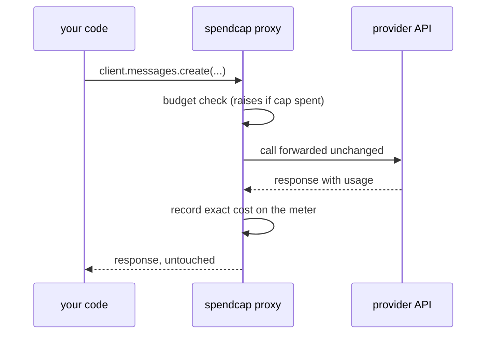

<h1 align="center">spendcap</h1>

<p align="center"><b>Real-time spend tracking, cost prediction, and runaway-loop circuit breakers for LLM API calls.</b></p>

<p align="center">
  <a href="https://github.com/ShreyanshGoyal/spendcap/actions/workflows/test.yml"></a>
  <a href="https://github.com/ShreyanshGoyal/spendcap"></a>
  <a href="LICENSE"></a>
  <a href="pyproject.toml"></a>
</p>

<p align="center">
  
</p>

<p align="center">
  <a href="#why-spendcap">Why</a> ·
  <a href="#installation">Install</a> ·
  <a href="#quickstart">Quickstart</a> ·
  <a href="#how-it-works">How it works</a> ·
  <a href="#predict-a-loops-cost-before-running-it">Cost prediction</a> ·
  <a href="#api-at-a-glance">API</a> ·
  <a href="#contributing">Contributing</a>
</p>

---

Your agent loop just spent $40 while you got coffee. Provider dashboards tell you *after* the money is gone. `spendcap` stops the loop *before* the next call, and tells you what a loop will cost before you run it at all.

- 🧮 **Exact metering.** Costs computed from the token counts your provider returns, not tokenizer guesses.
- 🛑 **Circuit breaker.** Set a hard USD cap; the call that would exceed it raises instead of hitting the API.
- 🔮 **Cost prediction.** Closed-form estimate of an agent loop's cost. Input grows *quadratically* with turns; most people underestimate this by 10x to 50x.
- 🏷️ **Task scoping.** Attribute spend to named tasks, with optional per-task caps.
- 📊 **Reports.** By model, by task, as text or JSON.
- 🪶 **Zero dependencies.** Works with the Anthropic and OpenAI SDKs (sync and async) and any duck-typed client whose responses carry `usage`.

## Why spendcap

Every existing way to watch LLM spend reports it after the fact. Enforcement, when it exists at all, lives in infrastructure you have to deploy. spendcap moves both into the process that is actually spending the money:

|  | spendcap | Provider dashboard | Observability platform | Gateway proxy |
| --- | --- | --- | --- | --- |
| Live spend visibility | Exact, in-process | Hours behind | Near real time | Yes |
| Stops the next call once a cap is spent | **Yes, raises before the API is reached** | No | No (alerts) | Some, per API key |
| Predicts a loop's cost before you run it | **Yes, closed form** | No | No | No |
| Per-task attribution with per-task caps | Yes | No | Tags, no caps | Per key |
| Setup | `pip install`, wrap your client | None | SDK plus external service | Deploy a proxy, route traffic |
| Runtime dependencies | **Zero** | n/a | Vendor SDK | Infrastructure |

These tools are complementary, not competing: platforms like Langfuse or Helicone give you dashboards and traces across services, and a LiteLLM proxy gives you org-wide key management. spendcap is the last line of defense inside the process: the library import that guarantees a runaway loop stops itself.

## Installation

```bash
pip install git+https://github.com/ShreyanshGoyal/spendcap.git
```

Python 3.9+, no runtime dependencies. A PyPI release is coming soon.

## Quickstart

Wrap your client. Nothing else changes.

```python
import anthropic
import spendcap

meter = spendcap.Meter(budget=spendcap.Budget(usd=5.00))
client = meter.wrap(anthropic.Anthropic())

# ... your agent loop, exactly as before ...
resp = client.messages.create(model="claude-haiku-4-5", max_tokens=1024,
                              messages=[{"role": "user", "content": "hi"}])

print(meter.spent)       # 0.0023  (USD, exact)
print(meter.remaining)   # 4.9977
```

When the cap is spent, the **next** call raises instead of reaching the API:

```python
try:
    while True:
        resp = client.messages.create(...)   # metered every call
        ...
except spendcap.BudgetExceededError as e:
    print(e)  # spendcap: meter budget exceeded (spent $5.0031 of $5.00 cap)
```

The call that *crosses* the cap still returns its response (you paid for it); the breaker refuses the one after. A warning fires once at 80% of the cap, configurable via `Budget(usd=5, warn_at=0.5, on_warn=my_callback)`. Set `Budget(hard=False)` for observe-only mode.

## How it works

`meter.wrap()` returns a transparent proxy around your client. Attribute access passes through untouched; only actual calls do metering work:



No provider SDK is imported and nothing is monkeypatched: the proxy is duck-typed against the `usage` shapes of the Anthropic and OpenAI SDKs (both API styles), handles sync and async clients with the same code path, and understands each provider's cache-billing semantics. The original client is always available as `client.__wrapped__`.

## Predict a loop's cost before running it

Agent loops resend the whole conversation every turn, so input tokens grow quadratically:

```python
est = spendcap.estimate_loop("claude-haiku-4-5", turns=200,
                             new_tokens_per_turn=1200,
                             output_tokens_per_turn=300,
                             system_tokens=1500)
print(est.summary())
```

```
Loop estimate: claude-haiku-4-5, 200 turns
  history growth: 1,200 new + 300 output tokens/turn, 1,500 system tokens
  total input: 30,390,000 tok   total output: 60,000 tok
  estimated cost: $30.69   (turn 1: $0.0042 -> turn 200: $0.3027, 72x growth)
  with 90% prompt-cache hits: $6.07
```

Compare models for the same loop:

```python
spendcap.compare_models(["claude-haiku-4-5", "gpt-5.4-mini", "gemini-3-flash"], turns=100)
# [('gpt-5.4-mini', ...), ('gemini-3-flash', ...), ...]  cheapest first
```

## Task scoping and per-task caps

```python
with meter.task("research", cap_usd=1.50):
    ...  # calls here are tagged 'research' and capped at $1.50

with meter.task("summarize"):
    ...

print(meter.report())
```

```
spendcap report: spent $2.4312 of $5.00 cap (48.6%)
  calls: 41   input: 1,912,340 tok   output: 96,200 tok   cached: 210,000 tok
  by model:
    claude-haiku-4-5            38 calls   $2.1201
    gpt-5.4-mini                 3 calls   $0.3111
  by task:
    research                    30 calls   $1.4890
    summarize                   11 calls   $0.9422
```

`meter.report().to_json()` for machines.

## No wrapper? Record manually

Works with any provider and any framework. Just feed it the usage numbers:

```python
meter.record("gpt-5.4-mini", input_tokens=1200, output_tokens=340)
meter.record("claude-haiku-4-5", input_tokens=100, cached_input_tokens=2000)
```

## API at a glance

| API | What it does |
| --- | --- |
| `Meter(budget=Budget(usd=5.00))` | Create a meter with a $5 hard cap |
| `meter.wrap(client)` | Return a metered proxy of any provider client |
| `meter.spent` / `meter.remaining` | Exact USD totals, live |
| `meter.task(name, cap_usd=...)` | Context manager: tag and cap a block of calls |
| `meter.record(model, ...)` | Meter a call manually from raw token counts |
| `meter.report()` | Spend breakdown by model and task (str or JSON) |
| `estimate_loop(model, turns, ...)` | Predict an agent loop's cost before running it |
| `compare_models([...], turns=...)` | Rank models by cost for the same loop |
| `register_model(...)` / `load_pricing(...)` | Override or extend the price table at runtime |

## Pricing data

Built-in prices (USD per 1M tokens) for current Anthropic, OpenAI, and Google models, verified **2026-07-17** (`spendcap.PRICING_AS_OF`). Model IDs resolve fuzzily: `anthropic/claude-haiku-4-5-20251001` resolves to `claude-haiku-4-5`. Unknown models warn once and book at $0, or raise with `Meter(strict_pricing=True)`.

Prices change. Override anything at runtime, no fork needed:

```python
spendcap.register_model("groq-llama-4-70b", input_per_m=0.59, output_per_m=0.79)
spendcap.load_pricing("my_prices.json")   # {"model": {"input": .., "output": .., "cached": ..}}
```

> Note: Claude Sonnet 5 is listed at its introductory $2/$10 rate, which runs through 2026-08-31 ($3/$15 after).

Cache accounting mirrors the providers: Anthropic cache reads bill at the cached rate and cache writes at 1.25x input (`input_tokens` already excludes both); OpenAI `prompt_tokens` includes cached tokens, so spendcap splits them out.

## Demo

No API key needed. A fake client that bills like the real thing:

```bash
python examples/runaway_agent.py
```

The loop's cost is predicted up front ($30.69 for 200 turns), then a $1.00 hard cap stops the runaway loop at turn 55 and the report shows where the money went. The GIF at the top of this page is this demo.

## Limitations (v0.1)

- **Streaming** responses that don't return usage aren't metered (spendcap warns once). Use `stream_options={"include_usage": True}` (OpenAI) or `meter.record()` manually. Full capture is [#3](https://github.com/ShreyanshGoyal/spendcap/issues/3).
- Wrapping is duck-typed; `isinstance` checks against the SDK's client class won't see through the proxy (`client.__wrapped__` gives the original).
- Budgets live in memory, per process. Persistence is [#5](https://github.com/ShreyanshGoyal/spendcap/issues/5).

## Roadmap

Each item is an open issue with a design sketch; discussion welcome.

- Streaming usage capture ([#3](https://github.com/ShreyanshGoyal/spendcap/issues/3))
- A CLI for estimates and the price table ([#4](https://github.com/ShreyanshGoyal/spendcap/issues/4))
- Persistent SQLite ledger, so caps survive restarts ([#5](https://github.com/ShreyanshGoyal/spendcap/issues/5))
- Google Gemini SDK support ([#2](https://github.com/ShreyanshGoyal/spendcap/issues/2))
- Prices for more providers ([#1](https://github.com/ShreyanshGoyal/spendcap/issues/1))
- LangChain and agent-framework callbacks

## Contributing

Issues and PRs are welcome. The [good first issues](https://github.com/ShreyanshGoyal/spendcap/labels/good%20first%20issue) are genuinely small and self-contained: price-table updates and new provider usage shapes.

```bash
pip install -e ".[dev]"
pytest
```

The only hard rule: spendcap stays zero-dependency.

## License

MIT © Shreyansh Goyal
